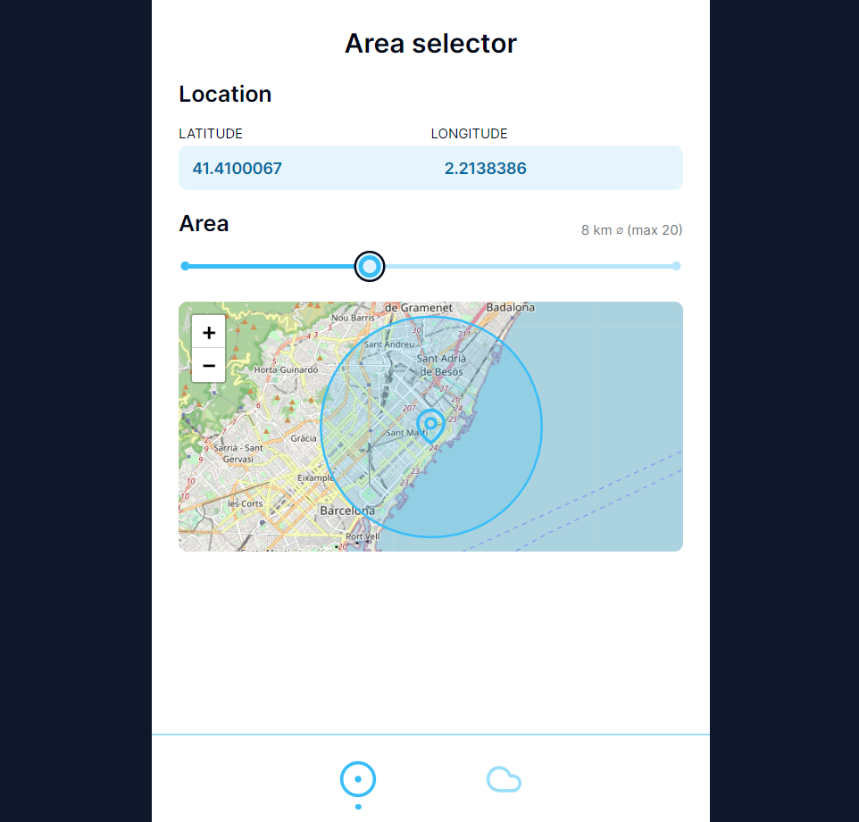
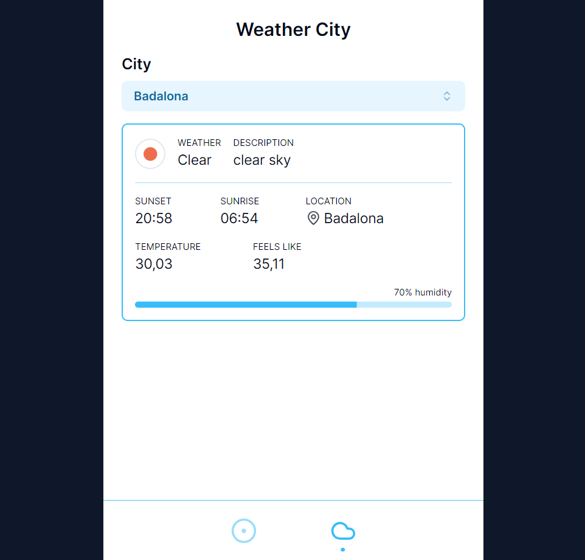

# up-test

### About

This is a web app exercise that contains two screens:

- <u>Area Selector</u>: Introduce some coordinates and a map below will show the location. In the map there is a marker with a circle area that can be modified with a slider bar. If you grant the right permissions, the coordinates by default will be the device's geo-location.

- <u>Weather City</u>: There is a city selector containing a small list of towns. Once there is a city selected, the weather card below will show the current weather conditions retrieved from the Open Weather API.

### Have a look

- Check it out on [https://up-test-delta.vercel.app](https://up-test-delta.vercel.app)

- ...or clone the repository, install the required dependencies (`npm install`) and run the app in the development mode (`npm start`), then open [http://localhost:3000](http://localhost:3000) to view it in your browser. (You will require a [https://openweathermap.org/](https://openweathermap.org/) API key in your .env file to be able to fetch the weather data)

### Stack

TypeScript, React, Tailwind CSS, ShadCN UI, Radix UI, Leaflet.

### Screenshots

